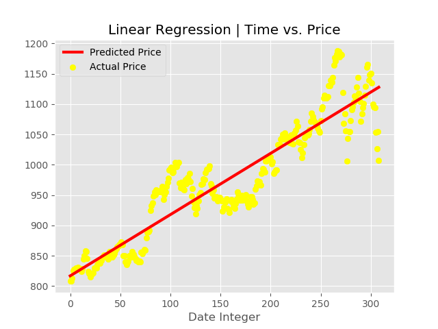

# Stock Prediction in 5 Steps

We are going to predict the stock prices using Linear Regression using the Quandl API.

Pre-requisites:
```
pip install pandas
pip install numpy
pip install quandl
pip install matplotlib
pip instal scikit-learn
```
Get your quand API Key by signing up on Quandl [here](https://www.quandl.com/account/profile)

* Step 1: 
    Get the stock from Quandl. We'll be using *WIKI/GOOGL*
    Other alternatives: *NSE/OIL.1, WIKI/AAPL.4, EIA/PET_RWTC_D* Read [here](https://www.quandl.com/databases/WIKIP/documentation?anchor=companies). 

* Step 2:
    Choose the target and features. For simplicity we have taken the Closed Price as the label and feature as the date (which is converted to integer by using the index function)
* Step 3: 
    Fitting a Linear Regression Model using Scikit-Learn's Linear Regression.
    ```
    from sklearn.linear_model import LinearRegression

    regressor = LinearRegression()
    regressor.fit(dates, prices)
    ```

* Step 4:
    Visualizing the Linear Regression model created (Google).
    
    
    ```
    #plotting data points
    plt.scatter(dates, prices, color='yellow', label= 'Actual Price') 

    #plotting regression line
    plt.plot(dates, regressor.predict(dates), color='red', linewidth=3, label = 'Predicted Price') 

    plt.title('Linear Regression | Time vs. Price')
    plt.legend()
    plt.xlabel('Date Integer')
    plt.show()
    ```
* Step 5:
    Predict the price using the model created in step 3.
    ```
    predicted_price =regressor.predict(date)
    ```